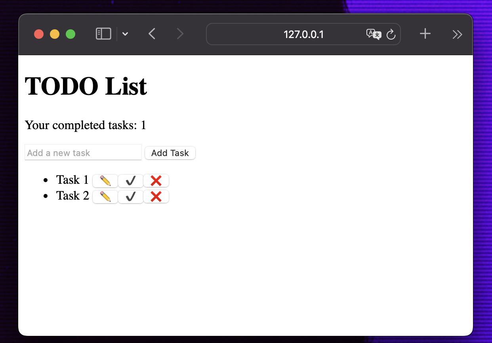

# ✅ TODO WEB APP TO TEST - Documentation

## 👋 Introduction

Welcome to my TODO web application documentation. This application serves as a simple, intuitive platform for managing daily tasks. Built with HTML/CSS/JS, Python FastAPI, and integrated with Pytest and Selenium for automated testing, this project demonstrates testing practices and continuous integration using Travis CI.

## 📋 Table of contents
- [✅ TODO WEB APP TO TEST - Documentation](#-todo-web-app-to-test---documentation)
	- [👋 Introduction](#-introduction)
	- [📋 Table of contents](#-table-of-contents)
	- [🏃‍♂️ Installation and Setup](#️-installation-and-setup)
		- [Requirements](#requirements)
		- [Installation Instructions](#installation-instructions)
		- [Running the Application](#running-the-application)
	- [🧠 Usage of the application](#-usage-of-the-application)
		- [UI Frontend](#ui-frontend)
		- [API Endpoints](#api-endpoints)
	- [🤖 Automated Testing](#-automated-testing)
		- [👈 Backend Testing -\> Pytest](#-backend-testing---pytest)
			- [1. Unit tests](#1-unit-tests)
			- [2. Integration tests](#2-integration-tests)
			- [3. Functional tests](#3-functional-tests)
		- [👉 Frontend Testing -\> Selenium](#-frontend-testing---selenium)
			- [Testing scenario](#testing-scenario)
	- [♻️ Continuous Integration and Deployment](#️-continuous-integration-and-deployment)
	- [🚀 Conclusion](#-conclusion)

---
## 🏃‍♂️ Installation and Setup

### Requirements

- Python 3.9+
- virtualenv

### Installation Instructions

1. Clone the repository: `git clone https://github.com/yourusername/web-todo-app.git`
2. Launch virtual environment
3. Go to project folder
4. Install all dependencies: `pip install requirements.txt`

### Running the Application

1. In project folder run application: `uvicorn main:app --reload`
2. Open web browser on the indicated IP

---
## 🧠 Usage of the application

The application is structured into two main components: the frontend, built with HTML/CSS/JS for a dynamic user experience, and the backend, powered by Python FastAPI for efficient, scalable API services.

### UI Frontend

The frontend of the application displayed in the image appears to be a simple to-do list web application, which is likely designed to help users manage their tasks. Here is a detailed description:

- `Your completed tasks`: Counter of completed tasks
- `Add a new task`: Field where user can type his task
- `Add task`: Button which approve addition the task to the list
- `✏️`: Button dzięki któremu użytkownik może zmienić nazwę zadania
- `✔️`: Button dzięki któremu użytkownik może oznaczyć zadanie jako wykonane
- `❌`: Button dzięki któremu użytkownik może usunąć zadanie z listy

### API Endpoints

The following endpoints are responsible for the operation of the application:

- `GET /`: Open index.html
- `GET /tasks`: Fetch all tasks
- `POST /tasks`: Create a new task
- `PUT /tasks/{task_id}/complete`: Complete chosen task
- `GET /tasks/completed/count`: Count all completed tasks
- `PUT /tasks/{task_id}/update`: Rename chosen task
- `DELETE /tasks/{task_id}`: Delete chosen task

*The backend code can be found here [`project/app/api/task_api.py`](https://github.com/jakestolarsky/todo_pywebapp_to_test/blob/main/project/app/api/task_api.py)*

---
## 🤖 Automated Testing

Automated testing ensures our application's reliability through unit, integration, functional and acceptance tests using Pytest for backend testing and Selenium for frontend testing. All tests are in here [`project/tests`](https://github.com/jakestolarsky/todo_pywebapp_to_test/tree/main/project/tests)

### 👈 Backend Testing -> Pytest

Backend tests have been divided into three sections: 

#### 1. Unit tests

These unit tests validate the behavior of a task model defined with Pydantic, ensuring default values are correctly set, custom values are accurately assigned, and validation errors are raised for invalid inputs or missing required fields. They cover scenarios including setting default properties, assigning custom values to a task, and handling invalid or incomplete task data.

*Can be found here: [`project/tests/unit/test_task_schema.py`](https://github.com/jakestolarsky/todo_pywebapp_to_test/blob/main/project/tests/unit/test_task_schema.py)*

#### 2. Integration tests 

These integration tests validate the behavior of a task management system by ensuring tasks can be added, removed, and searched by ID within a list, and that tasks without required fields raise validation errors. The tests use the Pydantic library for data validation and pytest fixtures for setup and teardown, ensuring a clean state for each test.

*Can be found here: [`project/tests/integration/test_task_model.py`](https://github.com/jakestolarsky/todo_pywebapp_to_test/blob/main/project/tests/integration/test_task_model.py)*

#### 3. Functional tests 

These system tests, implemented with pytest and FastAPI's TestClient, validate various aspects of a task management application. They cover functionalities such as creating tasks with specific attributes, reading and updating task details, counting completed tasks, and handling errors for non-existent tasks, ensuring the application's endpoints respond correctly to user inputs and state changes.

*Can be found here: [`project/tests/functional/test_task_api.py`](https://github.com/jakestolarsky/todo_pywebapp_to_test/blob/main/project/tests/functional/test_task_api.py)*

### 👉 Frontend Testing -> Selenium

To ensure that all functionalities perform correctly on the frontend, a simple test scenario was created and implemented using Selenium [`project/tests/acceptance/selenium_tests/test_to_do_app.py`](https://github.com/jakestolarsky/todo_pywebapp_to_test/blob/main/project/tests/functional/test_task_api.py)

#### Testing scenario

1. Initialize WebDriver and Navigate to Application

	- **Objective:** Ensure the WebDriver can open Chrome and navigate to the application.
	- **Expected Outcome:** The application loads successfully.

2. Add a New Task

	- **Objective:** Verify that a user can add a new task to the list.
	- **Steps:**
		  1. Locate the task input field and add button.
		  2. Enter a task name and click the add button.
		  3. Verify the new task appears in the task list.
	- **Expected Outcome:** The task list includes the new task.

3. Complete a Task

	- **Objective:** Ensure that completing a task updates the completed tasks counter.
	- **Steps:**
		  1. Click the complete task button for a task.
		  2. Check the completed tasks counter.
	- **Expected Outcome:** The completed tasks counter increments by 1.

4. Add Multiple Tasks

	- **Objective:** Test the ability to add several tasks consecutively.
	- **Steps:**
		  1. Add three distinct tasks using the task input and add button, clearing the input each time.
		  2. Verify the number of tasks in the list matches the number added.
	- **Expected Outcome:** Exactly three tasks are present in the list.

5. Delete the First Two Tasks

	- **Objective:** Confirm tasks can be deleted, and the task list updates correctly.
	- **Steps:**
		  1. Delete the first two tasks in the list.
		  2. Verify the remaining tasks and completed tasks counter.
	- **Expected Outcome:** One task remains, and the completed tasks counter is unchanged.

6. Change a Task Name

	- **Objective:** Check if the edit functionality properly updates a task's name.
	- **Steps:**
		  1. Click the edit button for a task and change its name.
		  2. Confirm the change and verify the task list.
	- **Expected Outcome:** The task's name is updated in the list.

7. Add a Task and Refresh the Page

	- **Objective:** Test if tasks persist after refreshing the page.
	- **Steps:**
		  1. Add a new task and then refresh the page.
		  2. Count the tasks in the list.
	- **Expected Outcome:** The tasks remain in the list after the page is refreshed.

8. Complete Tasks and Refresh the Page

	- **Objective:** Verify that the completion state of tasks persists after a page refresh.
	- **Steps:**
		  1. Complete all tasks, then refresh the page.
		  2. Check the completed tasks counter.
	- **Expected Outcome:** The completed tasks counter reflects the correct number of completed tasks after refreshing.

---
## ♻️ Continuous Integration and Deployment

Travis CI is set up for continuous integration, running tests on every commit.

---
## 🚀 Conclusion

This documentation outlines the Web TODO application and its emphasis on automated testing and CI/CD practices. Thanks for all and I wish you best ✨
